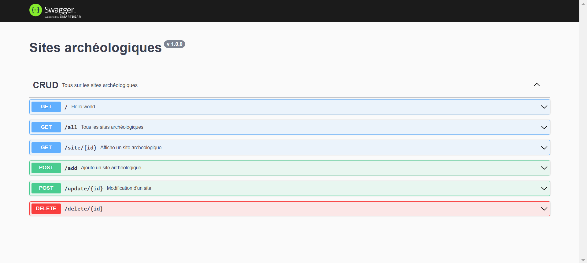

# API REST

Cette application a été réalisé en NodeJS et ElasticSearch.

Elle permet la gestion des sites archéologiques en utilisant Elasticsearch pour le stockage d’informations au format JSON.

Swagger est utilisé pour la documentation de cette API.

## Comment construire une API avec NodeJS et ElasticSearch ?

1. Téléchager le projet
2. Importation des données.
- Pour cela, lancez kibana et allez sur http://localhost:5601/app/ml/filedatavisualizer (Machine Learning / File Upload) 
- Importer le fichier france2.csv
- Nommez l'index "sites_archeo"

3. Installez les dépendances

4. Lancez le projet et allez sur http://localhost:4040/api-docs/

5. Il existe trois grands types de requêtes : POST, GET et DELETE

GET : Affichage d'un seul site à partir de son id et la liste des sites archéologiques  

POST : Ajout et modification d'un site  

DELETE : Suppression d'un site

